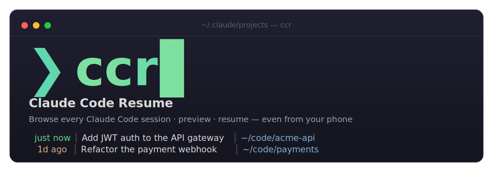
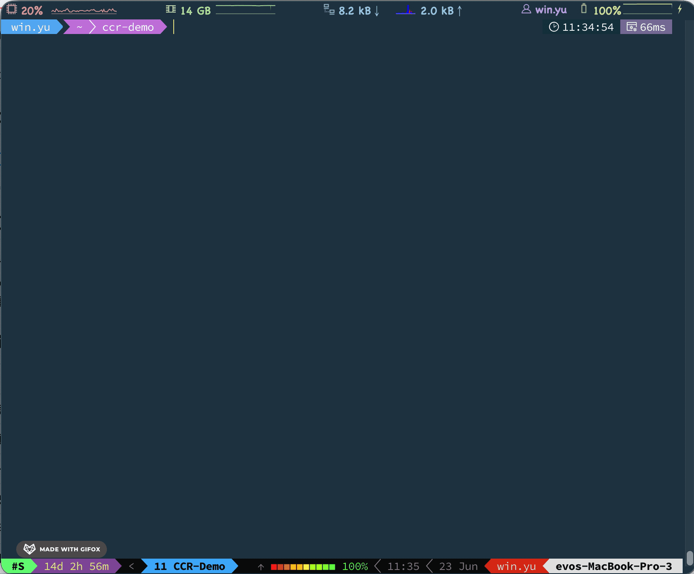

<p align="center">
  
</p>

<p align="center">
  <code>ccr</code> — a fuzzy-search picker for resuming Claude Code sessions across every project.
</p>

---

Browse **all your Claude Code sessions across every project** in a fuzzy-search
menu, see a rich preview of each, then resume the one you want — `ccr` auto-`cd`s
into the session's working directory and runs `claude --resume` for you. No more
hunting for which folder a conversation lived in.

It can also resume a session with **mobile Remote Control** enabled, so you can
pick the conversation back up from your phone or the web.

<p align="center">
  
</p>

```
 just now │ Add JWT auth to the API gateway      │ ~/code/acme-api
   2m ago │ Fix flaky checkout integration test  │ ~/code/storefront
   1d ago │ Refactor the payment webhook handler │ ~/code/payments-svc
  11d ago │ Set up the CI release pipeline       │ ~/code/infra
┌──────────────────────────────────────────────────────────┐
│ 📌 Add JWT auth to the API gateway                       │
│ 🕒 2026-06-20 14:08  (just now)                          │
│ 📁 /Users/you/code/acme-api                              │
│ 🔑 0a1b2c3d-4e5f-6789-abcd-ef0123456789                  │
│ 💬 last prompt: extract the token check into middleware  │
└──────────────────────────────────────────────────────────┘
Enter resume  ^R +remote  ^Y print cmd  │  sort ^T time ^O title ^G dir  │  Esc quit
```

(中文說明請見 [下方](#中文說明)。)

## Features

- **Cross-project** — scans `~/.claude/projects/*/*.jsonl`, every session, every folder.
- **Rich preview** — AI-generated title, timestamp, working directory, session id, and the last prompt.
- **One-key resume** — `Enter` cd's into the project and runs `claude --resume`.
- **Quick resume** — `ccr --last` / `ccr -n N` resume straight away without opening the menu.
- **Mobile handoff** — `Ctrl-R` resumes with `--remote-control` so you can continue on the Claude mobile app / web.
- **Live sorting** — by time, title, or working directory; switch inside the menu without restarting.
- **Color & alignment** — recency-colored timestamps, CJK-width-aware columns that line up even with mixed Chinese/English titles.
- **Bilingual UI** — English / 繁體中文, auto-detected from `$LANG`.
- **Fast** — caches the parsed index and only re-reads sessions whose files changed.
- **Zero config** — a single self-contained Bash script. No daemon, no background process.

## Requirements

- `bash` (3.2+, the macOS default works)
- [`fzf`](https://github.com/junegunn/fzf)
- `python3`
- the `claude` CLI (to actually resume)

## Install

```sh
git clone https://github.com/kylinfish/claude-code-resume.git
cd claude-code-resume
./install.sh            # symlinks bin/ccr into ~/.local/bin
./install.sh --tip      # also add a one-line startup hint to your shell rc
```

Or just drop `bin/ccr` anywhere on your `PATH`.

## Usage

```sh
ccr                      # all sessions, newest first
ccr .                    # only sessions whose cwd is under the current directory
ccr ~/code/myproject     # only sessions under a given directory
ccr --last               # resume the most recent session, no menu
ccr -n 2                 # resume the 2nd most recent session, no menu
ccr -s title             # sort by title  (time | title | dir)
ccr --lang zh            # force Chinese UI (default: auto-detect from $LANG)
ccr --help
```

### In-menu keys

| Key      | Action                                                        |
| -------- | ------------------------------------------------------------- |
| `Enter`  | resume the selected session                                   |
| `Ctrl-R` | resume **+ mobile Remote Control** (`--remote-control`)       |
| `Ctrl-Y` | print the `cd … && claude --resume …` command without running |
| `Ctrl-T` | sort by time                                                  |
| `Ctrl-O` | sort by title                                                 |
| `Ctrl-G` | sort by working directory                                     |
| `Esc`    | quit                                                          |

> **Remote Control** requires a Claude Pro/Max/Team/Enterprise subscription, and
> your machine must stay running and online — the phone/web is just a window into
> the session that keeps running locally.

## Environment variables

| Variable            | Purpose                                                          |
| ------------------- | ---------------------------------------------------------------- |
| `CCR_LANG`          | `zh` or `en` — override the UI language                          |
| `CCR_PROJECTS_DIR`  | override the scan path directly                                  |
| `CLAUDE_CONFIG_DIR` | Claude's config dir; `ccr` scans `$CLAUDE_CONFIG_DIR/projects`   |
| `CCR_CACHE`         | override the index cache dir (default `~/.cache/ccr`)            |

> Scan path resolution: `CCR_PROJECTS_DIR` → `$CLAUDE_CONFIG_DIR/projects` → `~/.claude/projects`.

## How it works

Each Claude Code session is one `.jsonl` file under `~/.claude/projects/<slug>/`.
`ccr` reads every file, pulling the latest `ai-title` (falling back to an older
`summary` or the first user prompt), the last prompt, the working directory
(`cwd`), and the file's modification time. It renders an aligned, colored list
into `fzf`; the hidden columns feed the preview pane and the final
`cd "$cwd" && claude --resume "$sessionId"`.

Sorting is done in the scan step, so the in-menu sort keys simply `reload` the
list. A small on-disk index cache (`~/.cache/ccr`) keyed by file modification
time means unchanged sessions are never re-parsed — startup stays fast even with
hundreds of sessions.

## License

[MIT](./LICENSE) © 2026 kylinfish

---

## 中文說明

`ccr` 讓你在一個模糊搜尋選單裡瀏覽**所有專案、所有 Claude Code 歷史對話**，
看到每個 session 的摘要預覽，選定後自動 `cd` 到該專案目錄並 `claude --resume`，
不必再手動記哪段對話在哪個資料夾。也可一鍵開啟**手機遠端控制**，用手機或網頁接手。

### 功能

| 功能 | 說明 |
| ---- | ---- |
| 跨專案掃描 | 掃 `~/.claude/projects/*/*.jsonl` 全部 session |
| 預覽 | AI 標題、時間、工作目錄、session id、最後一次 prompt |
| 一鍵 resume | `Enter` 直接切目錄並 `claude --resume` |
| 快速 resume | `ccr --last` / `ccr -n N` 不開選單直接續 |
| 手機接手 | `Ctrl-R` 加 `--remote-control`，用 Claude 手機 app／網頁繼續 |
| 即時排序 | 時間／標題／目錄，選單內直接切換 |
| 彩色 + 對齊 | 時間依新舊上色，正確計算全形字寬度，中英混排也對齊 |
| 中英雙語 | 依 `$LANG` 自動偵測，可用 `--lang` 或 `CCR_LANG` 覆寫 |
| 快取加速 | 依檔案修改時間快取索引，沒變動的 session 不重複解析 |
| 零設定 | 單一 Bash 腳本，無背景程式、無狀態檔 |

### 需求

`bash`（3.2+）、[`fzf`](https://github.com/junegunn/fzf)、`python3`、`claude` CLI。

### 安裝

```sh
git clone https://github.com/kylinfish/claude-code-resume.git
cd claude-code-resume
./install.sh          # 連結 bin/ccr 到 ~/.local/bin
./install.sh --tip    # 另外在 shell 啟動時加一行提示
```

也可以直接把 `bin/ccr` 放到任何 `PATH` 目錄下。

### 用法

| 指令 | 作用 |
| ---- | ---- |
| `ccr` | 列出所有 session，最新在上 |
| `ccr .` | 只看當前目錄(含子目錄)的 session |
| `ccr <path>` | 只看指定目錄(含子目錄)的 session |
| `ccr --last` | 不開選單，直接續最近一個 session |
| `ccr -n N` | 不開選單，直接續第 N 新的 session |
| `ccr -s title` | 依標題排序（`time`｜`title`｜`dir`） |
| `ccr --lang zh` | 強制中文介面（預設依 `$LANG` 自動偵測） |
| `ccr --help` | 顯示說明 |

### 選單內快捷鍵

| 按鍵 | 行為 |
| ---- | ---- |
| `Enter` | 開啟選定的 session |
| `Ctrl-R` | 開啟 **+ 手機遠端控制**（`--remote-control`） |
| `Ctrl-Y` | 只印出 `cd … && claude --resume …` 指令，不執行 |
| `Ctrl-T` | 依時間排序 |
| `Ctrl-O` | 依標題排序 |
| `Ctrl-G` | 依工作目錄排序 |
| `Esc` | 取消 |

> 手機遠端控制需 Claude Pro/Max/Team/Enterprise 訂閱，且本機需持續開著並連網
>（手機只是視窗，運算仍跑在你電腦）。

### 環境變數

| 變數 | 用途 |
| ---- | ---- |
| `CCR_LANG` | `zh` 或 `en`，覆寫介面語言 |
| `CCR_PROJECTS_DIR` | 直接覆寫掃描路徑 |
| `CLAUDE_CONFIG_DIR` | Claude 設定目錄；`ccr` 會掃 `$CLAUDE_CONFIG_DIR/projects` |
| `CCR_CACHE` | 覆寫索引快取目錄（預設 `~/.cache/ccr`） |

> 掃描路徑優先序：`CCR_PROJECTS_DIR` → `$CLAUDE_CONFIG_DIR/projects` → `~/.claude/projects`。

### 授權

[MIT](./LICENSE) © 2026 kylinfish
